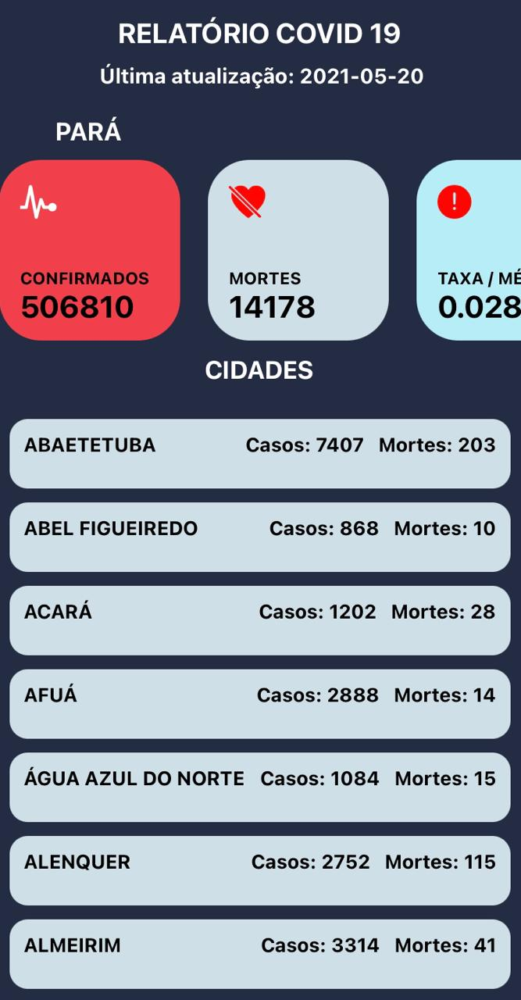

<h1>COVID APP - Relatório Paraense </h1>

##### App feito com React Native e Expo, consumindo os dados da API <a href="https://brasil.io">Brasil.io</a>

### `Descrição`

App desenvolvido com React Native e Expo usando Axios para consumir a api e React Hooks para manipular os dados. Todos os dados foram obtidos pelas Secretarias de Saúde das Unidades Federativas e foram tratados por Álvaro Justen e colaboradores da Brasil.io. Os dados dados convertidos estão sob a licença Creative Commons Attribution ShareAlike.

